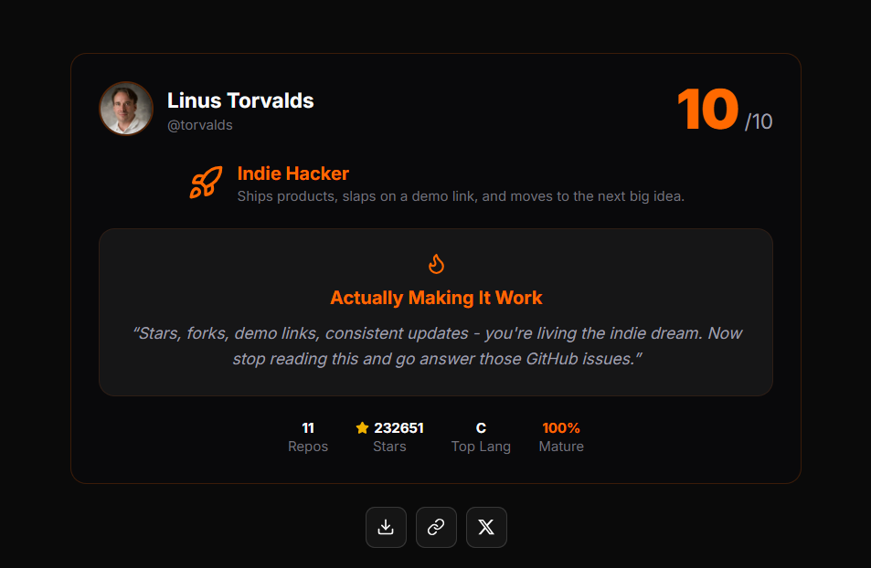

# 🔥 Dev Roast

Get your GitHub profile roasted. Enter a username, get a developer archetype, roast score, and a shareable card - all powered by real repo analysis, not AI hallucinations.

## Features

- **7 Developer Archetypes** - The Experimenter, Indie Hacker, Tutorial Collector, Open Source Monk, Overengineer Supreme, The Polyglot, One-Trick Pony
- **Smart Scoring** - Weighted analysis of maturity, consistency, engagement, documentation, and stability
- **60+ Roast Templates** - Viral-worthy, developer-focused humor across all archetypes and score ranges
- **Shareable Cards** - Export your roast result as a PNG image
- **OG Image Generation** - Dynamic Open Graph images for social sharing
- **Dark / Light Theme** - Follows system preference with manual toggle

## How It Works

1. Enter a GitHub username
2. The engine fetches public repos, READMEs, releases, and commit activity
3. Repos are scored individually (engagement, maintenance, stability, documentation)
4. Developer metrics are computed (maturity ratio, abandonment ratio, language diversity, etc.)
5. A personality archetype is detected based on metric patterns
6. A final score (1–10) is calculated and a matching roast template is picked
7. You get roasted 🔥
